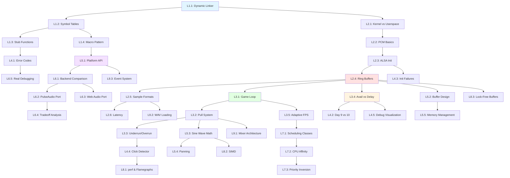

# 🔊 X11 Audio Learning Journey: From Cargo-Culting to Competence

> **Mission:** Transform from "copy-pasting ALSA outputs" to "architecting cross-platform audio systems"  
> **Student:** Full-stack web developer (React/Node.js) learning systems programming  
> **Constraint:** Currently blindly following LLM suggestions without understanding  
> **Goal:** Own the audio stack—debug it, modify it, port it

---

## Phase 1: Implementation Analysis

### Current Code Audit

**Files Analyzed:**
- `audio.c` (997 lines): ALSA dynamic loading, initialization, buffer management, debug visualization
- `audio.h` (279 lines): Type definitions, function signatures, state structures
- `backend.c` (951 lines): Main game loop, OpenGL rendering, adaptive FPS system
- `backend.h` (10 lines): Minimal header (just includes)
- `base.h` (105 lines): Core macros, FPS/latency configuration

**Architecture Pattern Detected:**
```
Casey's Windows Pattern → Your Linux Port
━━━━━━━━━━━━━━━━━━━━━━━━━━━━━━━━━━━━━━━━━━
DirectSound (dsound.dll)  →  ALSA (libasound.so)
LoadLibrary/GetProcAddress → dlopen/dlsym
PlayCursor/WriteCursor     → snd_pcm_delay/snd_pcm_avail
IDirectSoundBuffer         → snd_pcm_t handle
Secondary buffer (ring)    → Your sample_buffer (linear)
```

**Complexity Level:** INTERMEDIATE-TO-ADVANCED
- ✅ You've already implemented Day 7-20 of Handmade Hero audio
- ✅ Dynamic library loading (dlopen) working
- ✅ Ring buffer logic (via ALSA) functioning
- ✅ Debug visualization markers implemented
- ⚠️ But you don't understand WHY it works or HOW to debug failures

---

### Mystery Code Identification (Your Cargo-Culted Sections)

**Top 5 "Magic Incantations" You've Been Copying:**

1. **ALSA Latency Calculation** (`audio.c:269-285`)
   ```c
   int32_t latency_sample_count = game_update_hz * 2; // WHY times 2?
   int32_t latency_microseconds = (latency_sample_count * 1000000) / samples_per_second;
   ```
   - **Mystery:** Why `game_update_hz * 2`? What happens if you change to `* 3` or `* 1`?
   - **Web Dev Analogy Needed:** This is like setting `setTimeout` delay—but for audio buffering

2. **Dynamic Library Symbol Loading** (`audio.c:133-200`)
   ```c
   *(void **)(&SndPcmOpen_) = dlsym(alsa_lib, "snd_pcm_open");
   ```
   - **Mystery:** The `*(void **)(&...)` cast—why double pointer? What's `dlsym` actually returning?
   - **Your Mental Model Gap:** You think of imports as `import { sndPcmOpen } from 'alsa'`—not runtime symbol lookup

3. **ALSA Underrun Recovery** (`audio.c:364-386`)
   ```c
   if (frames_written == -EPIPE) {
     SndPcmRecover(handle, -EPIPE, 0);
   }
   ```
   - **Mystery:** What's EPIPE? Why recover silently (`0` flag)?
   - **Debugging Nightmare:** If audio clicks, is it underrun? Overrun? Wrong buffer size?

4. **Audio Marker Timing** (`audio.c:51-60`, `audio.h:215-250`)
   ```c
   int64_t play_cursor_sample = running_index - delay;
   ```
   - **Mystery:** What's `running_index`? Why subtract delay? How does this map to DirectSound cursors?
   - **Your Confusion:** In Node.js streams, you track bytes consumed—here it's samples queued vs played

5. **Frame-Aligned Audio Writes** (`backend.c:829-861`)
   ```c
   game_sound_output.game_update_hz = adaptive.target_fps;
   ```
   - **Mystery:** Why tie audio update rate to FPS? Doesn't audio run at 48kHz, not 60Hz?
   - **The Trick:** Game logic runs at 60Hz, fills 1/60th second of audio each frame

---

### Prerequisite Skill Gaps (Web Dev → Systems Programming)

| Web Concept | Systems Equivalent | Your Gap |
|------------|-------------------|----------|
| `fetch()` async request | `dlopen()` + `dlsym()` | Don't understand symbol resolution at runtime |
| `Buffer.from(array)` | `malloc()` + manual pointer arithmetic | Assume buffers auto-resize, don't understand alignment |
| `stream.write()` non-blocking | `snd_pcm_writei()` returns partial writes | Expect all-or-nothing writes like HTTP responses |
| Event loop (`setInterval`) | `clock_gettime()` + manual sleep | Think event-driven, not polling-driven |
| File descriptor (`fs.createReadStream`) | ALSA `snd_pcm_t` handle | Don't grasp kernel resource handles |
| Promise rejection | `errno` + `SndStrerror()` | Expect exceptions, not error codes in return values |

**Critical Prerequisite Concepts (Must Learn First):**
1. **Pointers & Memory Layout:** You need byte-level thinking (not object references)
2. **File Descriptors:** Kernel resource handles (not just "file paths")
3. **System Calls:** Crossing userspace→kernel boundary (expensive!)
4. **Ring Buffers:** Why circular? How does wrap-around work?
5. **Latency vs Throughput:** Why 66ms audio buffer feels "instant" but 500ms video lag is obvious

---

### Success Criteria (Per-Unit Competence Milestones)

**Unit Completion Rubric:**

| Level | Criteria | Example Test |
|-------|----------|-------------|
| **1 - Awareness** | Can identify the concept in code | "Point to where ring buffer wrap happens" |
| **2 - Comprehension** | Can explain WHY it works | "Why does ALSA use microseconds for latency, not frames?" |
| **3 - Application** | Can modify without breaking | "Change latency from 2 frames to 4 frames" |
| **4 - Analysis** | Can debug failures | "Audio clicks: is it underrun, overrun, or timing?" |
| **5 - Synthesis** | Can implement from scratch | "Write PulseAudio version using same patterns" |
| **6 - Evaluation** | Can critique tradeoffs | "Why ALSA over PulseAudio? When would you switch?" |

**Per-Unit Targets:**
- Unit 1-2: Reach Level 3 (Can modify)
- Unit 3-4: Reach Level 4 (Can debug)
- Unit 5-6: Reach Level 5 (Can reimplement)

---

## Phase 2: Core Learning Units (Generated from Your Code)

### Unit 1: Dynamic Library Loading & Symbol Resolution
**Goal:** Understand `dlopen/dlsym` pattern so you stop cargo-culting stub functions  
**Duration:** 3-4 days (2-3 hours/day)  
**Prerequisite:** Pointers (you need this first!)

#### Lessons:

**L1.1: The Dynamic Linker's Job (What Happens Before main())**
- *Connects to:* L2.3 (ALSA initialization), L4.1 (why audio can fail gracefully)
- *Enables:* Understanding why Casey uses dynamic loading vs static linking
- **Content:**
  - Compare `#include <alsa/asoundlib.h>` + `-lasound` (static) vs your `dlopen("libasound.so.2")` (dynamic)
  - **Web Analogy:** Static linking = bundling React into your app; Dynamic = CDN script tag
  - **Exercise:** Run `ldd ./game` — explain every line of output
  - **Debug Challenge:** Delete `libasound.so.2` temporarily — what error? Why doesn't app crash immediately?

**L1.2: Symbol Tables & Function Pointers (The `*(void **)(&...)` Mystery)**
- *Prerequisite:* L1.1
- *Connects to:* L3.2 (function call overhead), L5.1 (vtables in other engines)
- **Content:**
  - Dissect `audio.c:133-200`: Why cast to `void **`, then dereference?
  - **Mental Model:** Symbol = name→address mapping in ELF file
  - **Exercise:** Write tiny `dlopen` wrapper that loads `libm.so` and calls `cos()` without `#include <math.h>`
  - **Critical Mistake to Avoid:** Forgetting to check `dlsym() != NULL` before calling
  - **Connectivity:** This pattern appears in OpenGL extension loading, plugin systems, game mod APIs

**L1.3: Stub Functions & Graceful Degradation (audio.c:73-131)**
- *Prerequisite:* L1.2
- *Connects to:* L4.2 (error handling philosophy), Unit 6 (porting to platforms without audio)
- **Content:**
  - Why do stubs return `-1` or `0`, not crash?
  - Casey's philosophy: "Silent failure beats crash on launch"
  - **Exercise:** Modify stubs to log to `stderr` when called — does audio code detect failures?
  - **Real-World Scenario:** Your game ships on old Linux without ALSA — what UX do users see?

**L1.4: The `#define SndPcmOpen SndPcmOpen_` Pattern (audio.h:166-176)**
- *Prerequisite:* L1.2, L1.3
- *Connects to:* Unit 2 (why clean API matters for maintenance)
- **Content:**
  - Why use macro redirection instead of calling `SndPcmOpen_` directly?
  - **Exercise:** Remove macros, call `_` versions directly — what breaks? Why?
  - **Aha Moment:** This is Casey's "API invariant" — game code never knows about stubs

---

### Unit 2: ALSA Architecture & Audio Hardware Model
**Goal:** Stop thinking "play audio file" and start thinking "write samples to kernel ring buffer"  
**Duration:** 4-5 days  
**Prerequisite:** Unit 1 completed

#### Lessons:

**L2.1: Kernel Drivers vs Userspace APIs (Where Does ALSA Live?)**
- *Connects to:* L1.1 (why we load `.so` not `.ko`), L3.4 (why audio writes can block)
- **Content:**
  - Diagram: Your app → libasound.so → ALSA kernel driver → sound card DMA
  - **Web Analogy:** Browser JS → Web Audio API → OS audio stack → speakers
  - **Exercise:** Run `aplay -l` — explain device names like `hw:0,0` vs `default`
  - **Debug Tool:** `strace -e ioctl ./game` — see kernel calls in real-time

**L2.2: PCM vs MIDI vs Raw Audio (Why "Pulse Code Modulation"?)**
- *Prerequisite:* L2.1
- *Connects to:* L2.5 (sample formats), L3.1 (why 48kHz not 44.1kHz)
- **Content:**
  - What's a "sample"? (Voltage snapshot at 48000Hz = 48000 numbers/sec)
  - **Visual:** ASCII waveform diagram of sine wave → discrete samples
  - **Exercise:** Record 1 second of silence: `arecord -d 1 test.wav` — inspect file size, calculate sample count
  - **Wrong Assumption to Break:** "Audio is MP3 files" — no, audio is raw sample arrays

**L2.3: ALSA Initialization Sequence (audio.c:269-362)**
- *Prerequisite:* L2.1, L2.2, L1.2
- *Connects to:* L4.3 (what breaks at each step)
- **Content:**
  - Line-by-line walkthrough: `snd_pcm_open` → `snd_pcm_set_params` → `snd_pcm_prepare`
  - **The Trick:** `snd_pcm_set_params` is Casey's "easy mode" — one call, not 20
  - **Exercise:** Replace `snd_pcm_set_params` with manual `snd_pcm_hw_params_*` calls (hard mode)
  - **Debugging:** Add printfs before EVERY ALSA call — watch initialization order

**L2.4: Ring Buffer Mental Model (audio.c:470-603)**
- *Prerequisite:* L2.3
- *Connects to:* L3.3 (underrun/overrun), L2.5 (why "interleaved")
- **Content:**
  - ALSA manages ring buffer IN KERNEL — you just write samples
  - **Web Analogy:** Like `ReadableStream` with backpressure — can't write faster than consumer reads
  - **Critical Diagram:**
    ```
    Ring Buffer (kernel):  [====PLAY===][===WRITE===][========]
                               ↑                ↑
                          Play Cursor      Write Cursor
    
    Your code writes samples at Write Cursor
    Hardware plays samples at Play Cursor
    If Write Cursor catches Play Cursor → UNDERRUN (silence/click)
    ```
  - **Exercise:** Implement tiny ring buffer in C (without ALSA) — `write()`, `read()`, wrap logic
  - **Common Bug:** Writing more samples than available space — ALSA returns partial write

**L2.5: Sample Formats & Interleaving (audio.c:338, audio.h:37-50)**
- *Prerequisite:* L2.4
- *Connects to:* L3.1 (why stereo = 2 channels), L5.2 (surround sound)
- **Content:**
  - S16_LE = Signed 16-bit Little Endian = int16_t = -32768 to +32767
  - Interleaved = `[L][R][L][R]` not `[L][L][L][R][R][R]`
  - **Exercise:** Generate 440Hz sine in left channel, 880Hz in right — hear octave
  - **Byte-Level:** `int16_t samples[4] = {1000, -1000, 2000, -2000}` — draw memory layout

**L2.6: Latency & Buffer Sizing (audio.c:269-285, base.h:75-94)**
- *Prerequisite:* L2.4, L2.5
- *Connects to:* Unit 3 (frame timing), L4.4 (why clicks happen)
- **Content:**
  - Casey's Day 19 change: `latency_sample_count = game_update_hz * FRAMES_OF_AUDIO_LATENCY`
  - **The Math:**
    - At 60 FPS, 2 frames = 33ms latency
    - At 30 FPS, 2 frames = 66ms latency
    - Formula: `latency_ms = (latency_sample_count / 48000) * 1000`
  - **Exercise:** Change `FRAMES_OF_AUDIO_LATENCY` to 1 — do you hear clicks? Why?
  - **Tradeoff:** Lower latency = more responsive, but more CPU work (tighter timing)

---

### Unit 3: Frame Timing & Audio-Video Synchronization
**Goal:** Understand how game loop drives audio (not the other way around)  
**Duration:** 5-6 days  
**Prerequisite:** Unit 2 completed

#### Lessons:

**L3.1: Game Loop Anatomy (backend.c:423-899)**
- *Connects to:* L2.6 (audio writes per frame), L3.4 (why sleep matters)
- **Content:**
  - Casey's pattern: Fixed timestep logic (30/60 FPS) + variable rendering
  - **Sequence:** Poll input → Update game (fills audio) → Render → Sleep → Repeat
  - **Exercise:** Add printf in loop — measure time for each phase
  - **Connectivity:** Same pattern in Unity's `FixedUpdate` vs `Update`

**L3.2: Audio as "Pull" System (game.c calls, platform provides)**
- *Prerequisite:* L3.1
- *Connects to:* L2.4 (ring buffer), L4.5 (why game logic controls audio)
- **Content:**
  - Game says "I need 800 samples for this frame" → platform writes to ALSA
  - **Web Analogy:** Like `requestAnimationFrame` callback — you provide data when requested
  - **Exercise:** Log `sound_output->samples_to_write` each frame — is it constant?
  - **Wrong Model:** Thinking audio "plays in background" — no, YOU fill it every frame

**L3.3: Underrun vs Overrun (audio.c:364-386, 1000-1014)**
- *Prerequisite:* L2.4, L3.2
- *Connects to:* L4.4 (debugging clicks)
- **Content:**
  - **Underrun (-EPIPE):** Write cursor caught play cursor → silence → click
  - **Overrun:** You wrote too fast (rare with ALSA blocking writes)
  - **Detection:** "AUDIO CLICK LIKELY" warning in your code (audio.c:1000-1014)
  - **Exercise:** Force underrun by `sleep(1)` in game loop — hear click, see recovery
  - **Real Debugging:** Is click from underrun or discontinuous wave (phase jump)?

**L3.4: `snd_pcm_avail` vs `snd_pcm_delay` (audio.c:639-680, audio.h:221-227)**
- *Prerequisite:* L2.4, L3.3
- *Connects to:* L4.2 (Day 9 vs Day 10 strategy)
- **Content:**
  - `snd_pcm_avail()`: How many frames can I write RIGHT NOW?
  - `snd_pcm_delay()`: How many frames are queued for playback?
  - **Mental Model:**
    ```
    Total Buffer = Avail + Delay
    If Delay is low → underrun risk
    If Avail is low → need to wait before writing more
    ```
  - **Exercise:** Print both every frame — graph relationship
  - **Your Code's Day 10 Mode:** Uses delay to predict cursor position (audio.c:1028-1104)

**L3.5: Adaptive FPS System (backend.c:789-866)**
- *Prerequisite:* L3.1, L2.6
- *Connects to:* L3.2 (audio buffer size changes with FPS)
- **Content:**
  - Why tie `game_update_hz` to audio latency?
  - **The Trick:** If 60 FPS is too fast, drop to 30 FPS (doubles audio buffer size!)
  - **Exercise:** Force FPS drop by adding `sleep(0.02)` in loop — watch adaptive system respond
  - **Trade-off Analysis:** Smooth 60 FPS with occasional clicks vs stable 30 FPS

---

### Unit 4: Error Handling & Debugging Audio Failures
**Goal:** Go from "it broke, copy-paste fix" to "diagnose root cause in 5 minutes"  
**Duration:** 4-5 days  
**Prerequisite:** Unit 1-3 completed

#### Lessons:

**L4.1: ALSA Error Codes (audio.c:232-268, 364-386)**
- *Connects to:* L1.3 (stubs return errors), L4.3 (which errors are fatal)
- **Content:**
  - ALSA returns negative errno: `-EPIPE`, `-EBUSY`, `-EINVAL`
  - `SndStrerror(err)` converts to human string
  - **Exercise:** Trigger each error deliberately (e.g., open device twice for -EBUSY)
  - **Debugging Workflow:** Error → `SndStrerror` → Google "ALSA EPIPE" → Understand cause

**L4.2: Day 9 vs Day 10 Strategy (audio.c:397-603 vs 605-753)**
- *Prerequisite:* L3.4, L2.6
- *Connects to:* L4.4 (when to use which)
- **Content:**
  - **Day 9:** Use `snd_pcm_avail` only — write what's available
  - **Day 10:** Use `snd_pcm_delay` — predict where cursor will be
  - **Your Code:** Checks if `snd_pcm_delay` exists, falls back to Day 9 (audio.c:224-230)
  - **Exercise:** Disable Day 10 path — compare audio quality
  - **Insight:** Day 10 is PREDICTION (might be wrong), Day 9 is REACTIVE (always safe)

**L4.3: Initialization Failure Modes (audio.c:269-362)**
- *Prerequisite:* L2.3, L4.1
- *Connects to:* L1.3 (graceful degradation)
- **Content:**
  - Each step can fail: `dlopen` → `dlsym` → `snd_pcm_open` → `snd_pcm_set_params`
  - **Exercise:** Comment out each step, run — what error message?
  - **Production Scenario:** User has PulseAudio, not ALSA — how to detect and suggest fix?

**L4.4: The Click Detector (audio.c:1000-1014)**
- *Prerequisite:* L3.3, L4.2
- *Connects to:* Unit 5 (eliminating clicks permanently)
- **Content:**
  - Why does code track `prev_write` amount?
  - **The Bug:** If write jumps from 800 → 400 samples, waveform has discontinuity → pop
  - **Exercise:** Log warnings for 1 minute — how many? Correlate with FPS drops?
  - **Root Cause Analysis:** Clicks from timing (underrun) or phase (bad sine wave math)?

**L4.5: Debug Visualization (audio.c:755-1000, audio.h:251-260)**
- *Prerequisite:* L3.4, L4.2
- *Connects to:* Unit 5 (using markers to tune latency)
- **Content:**
  - Casey's Day 19 markers: Track play/write cursor per frame
  - Your implementation: `g_debug_audio_markers[30]` array
  - **Exercise:** Enable debug overlay (if you added OpenGL rendering of markers)
  - **What to Look For:** Stable gap between play/write cursor = healthy buffering

---

### Unit 5: Advanced Audio Patterns & Cross-Platform Abstractions
**Goal:** Understand Casey's platform abstraction philosophy  
**Duration:** 5-6 days  
**Prerequisite:** Unit 1-4 mastered

#### Lessons:

**L5.1: Platform API Design (audio.h structure, game.h interface)**
- *Connects to:* L1.4 (API stability), Unit 6 (porting to new platforms)
- **Content:**
  - Game code sees `GameSoundOutput` — never knows ALSA exists
  - Platform code (audio.c) implements `linux_fill_sound_buffer()`
  - **Exercise:** Sketch PulseAudio version — what changes in .h? What stays same?
  - **Design Principle:** Game code shouldn't `#include <alsa/asoundlib.h>`

**L5.2: Sample Buffer vs Secondary Buffer (audio.c:189, audio.h:189)**
- *Prerequisite:* L2.4, L2.5
- *Connects to:* L3.2 (who owns memory)
- **Content:**
  - Your `sample_buffer` = temporary staging area
  - ALSA's kernel buffer = actual ring buffer
  - **Why Two Buffers?** Game generates samples → copy to kernel in one shot
  - **Exercise:** Measure copy overhead — is `memcpy` showing up in profiler?

**L5.3: Sine Wave Math (audio.c:470-603, especially tone generation)**
- *Prerequisite:* L2.5, L3.2
- *Connects to:* L4.4 (phase discontinuities cause clicks)
- **Content:**
  - `sin(2π * freq * time)` generates pure tone
  - **The Trick:** Track `running_sample_index` to avoid phase resets
  - **Exercise:** Reset phase every frame — hear clicks. Keep running index — smooth
  - **Math Review:** Why `2π`? Because sine wave period = 2π radians

**L5.4: Panning & Volume (audio.c:470-603, sound_output->pan_position)**
- *Prerequisite:* L5.3
- *Connects to:* Unit 6 (stereo → surround)
- **Content:**
  - Pan = balance left vs right volume
  - **Formula:** `left_vol = 100 - pan`, `right_vol = 100 + pan` (pan = -100 to +100)
  - **Exercise:** Implement circular panning (auto-rotate sound around head)
  - **Gotcha:** Clipping when `volume * pan > 32767` (int16_t max)

**L5.5: Memory Management (audio.c:110-189, platform_allocate_memory)**
- *Prerequisite:* Unit 1 (pointers), L5.2
- *Connects to:* Unit 6 (arena allocators in game code)
- **Content:**
  - Your code uses `PlatformMemoryBlock` pattern (Casey's abstraction)
  - **Exercise:** Replace with raw `malloc` — what breaks? Why is abstraction better?
  - **Casey's Philosophy:** Platform provides memory, game doesn't call `malloc` directly

---

### Unit 6: Porting & Alternative Audio Backends
**Goal:** Prove you understand by implementing PulseAudio OR WebAudio version  
**Duration:** 6-8 days  
**Prerequisite:** Unit 1-5 mastered (Level 5 competence)

#### Lessons:

**L6.1: Audio Backend Comparison Matrix**
- *Connects to:* All previous units (comparative analysis)
- **Content:**
  - ALSA (low-level, kernel) vs PulseAudio (high-level, daemon) vs JACK (pro audio)
  - **Tradeoffs:** ALSA = low latency but complex; Pulse = easy but higher latency
  - **Exercise:** Install PulseAudio, run `pactl list` — understand daemon architecture
  - **Decision Framework:** When would you use each? (Embedded = ALSA, Desktop = Pulse)

**L6.2: PulseAudio Simple API (Alternative Implementation)**
- *Prerequisite:* L6.1, Unit 2 (ALSA architecture)
- *Connects to:* L5.1 (platform abstraction)
- **Content:**
  - PulseAudio's "simple" API = 5 function calls (easier than ALSA!)
  - **Exercise:** Implement `audio_pulse.c` using `pa_simple_write()`
  - **Comparison:** How does `pa_simple_write` differ from `snd_pcm_writei`?
  - **Victory Condition:** Switch backends via `#define USE_PULSEAUDIO`, game runs unchanged

**L6.3: Web Audio API Port (For Browser/Emscripten)**
- *Prerequisite:* L6.1, Unit 3 (frame timing)
- *Connects to:* Your web dev background!
- **Content:**
  - Web Audio = `AudioContext` + `ScriptProcessorNode` (or AudioWorklet)
  - **Mental Model Shift:** Browser calls YOU (callback) vs you calling ALSA (push)
  - **Exercise:** Implement `audio_web.c` compiled with Emscripten
  - **The Twist:** Invert control flow — audio callback requests samples from game

**L6.4: Architecture Tradeoff Analysis**
- *Prerequisite:* L6.1, L6.2, L6.3
- *Connects to:* Final deliverable (MIGRATION-GUIDE.md)
- **Content:**
  - **Latency:** ALSA (5-20ms) vs Pulse (30-70ms) vs Web Audio (20-50ms)
  - **Complexity:** ALSA (hardest) vs Pulse (medium) vs Web (easiest)
  - **Portability:** ALSA (Linux-only) vs Pulse (Linux+BSD) vs Web (browsers)
  - **Exercise:** Create decision tree: "If platform X, use backend Y"

**L6.5: Real-World Debugging War Story**
- *Prerequisite:* Unit 4 (debugging skills)
- **Content:**
  - Simulate production issue: "Audio works on dev machine, silent on user's Ubuntu 22.04"
  - **Investigation Path:** Check ALSA devices → PulseAudio running? → Permissions?
  - **Exercise:** Deliberately misconfigure ALSA → diagnose → fix
  - **Lesson:** Always provide diagnostic mode (like your `linux_debug_audio_latency`)

---

## Phase 3: Extended Learning Units

### Unit 7: Real-Time Audio Constraints (NEW)
**Why This Unit?** Your code has adaptive FPS, but doesn't address priority inversion, CPU scheduling  
**Duration:** 3-4 days

#### Lessons:

**L7.1: Linux Scheduling Classes (SCHED_FIFO vs SCHED_OTHER)**
- **Content:** Why audio threads need real-time priority
- **Exercise:** Run `chrt -f 10 ./game` — measure latency improvement
- **Gotcha:** Requires `CAP_SYS_NICE` or `/etc/security/limits.conf` changes

**L7.2: CPU Affinity & Cache Effects**
- **Content:** Pin audio thread to single core to avoid cache misses
- **Exercise:** Use `taskset` to bind process, measure jitter reduction

**L7.3: Priority Inversion & Mutexes**
- **Content:** What if audio thread waits on mutex held by low-priority thread?
- **Exercise:** Deliberately create inversion, observe audio glitches

---

### Unit 8: Performance Profiling & Optimization
**Why This Unit?** Your code has debug timers, but no systematic profiling  
**Duration:** 4-5 days

#### Lessons:

**L8.1: `perf` and Flamegraphs**
- **Content:** Use Linux `perf` tool to find hotspots
- **Exercise:** `perf record ./game`, generate flamegraph, identify bottlenecks

**L8.2: SIMD for Audio Processing (SSE/AVX)**
- **Content:** Vectorize sine wave generation (4 samples at once)
- **Exercise:** Implement SSE2 version, benchmark vs scalar

**L8.3: Lock-Free Ring Buffers**
- **Content:** Why ALSA uses kernel ring buffer (lock-free for single producer/consumer)
- **Exercise:** Implement userspace lock-free ring buffer using atomics

---

### Unit 9: Game Audio Architecture Patterns
**Why This Unit?** Your current code generates sine waves, but real games need layered audio  
**Duration:** 5-6 days

#### Lessons:

**L9.1: Mixer Architecture (Multiple Sound Sources)**
- **Content:** How to play 3 sounds simultaneously (mix samples, prevent clipping)
- **Exercise:** Implement simple mixer: `output[i] = (sound1[i] + sound2[i] + sound3[i]) / 3`

**L9.2: WAV File Loading & Playback**
- **Content:** Parse WAV header, load PCM data, play instead of sine wave
- **Exercise:** Implement `load_wav()`, play explosion sound on keypress

**L9.3: Sound Effect Triggers (Event System)**
- **Content:** How game code says "play sound" without knowing ALSA
- **Exercise:** Implement `platform_play_sound(sound_id)` API

---

## Phase 4: Progress Tracking Structure

### Conceptual Dependency Graph

```
Unit 1: Dynamic Loading
  ├─→ Unit 2: ALSA (needs dlopen understanding)
  └─→ Unit 5: Platform API (why dynamic loading matters)

Unit 2: ALSA Architecture
  ├─→ Unit 3: Frame Timing (ring buffer feeds from game loop)
  ├─→ Unit 4: Debugging (need to know ALSA to debug it)
  └─→ Unit 6: Porting (compare ALSA to alternatives)

Unit 3: Frame Timing
  ├─→ Unit 4: Debugging (timing issues cause clicks)
  ├─→ Unit 7: Real-Time (why timing matters)
  └─→ Unit 9: Game Audio (how triggers fit in loop)

Unit 4: Debugging
  ├─→ Unit 6: Porting (debug new backends)
  └─→ Unit 8: Profiling (advanced debugging)

Unit 5: Advanced Patterns
  └─→ Unit 6: Porting (apply patterns to new platform)

Units 7-9: Can be learned in parallel after Unit 4
```

**Critical Path (Minimum Viable Competence):**  
Unit 1 → Unit 2 → Unit 3 → Unit 4 → Unit 6

**Depth Path (Systems Mastery):**  
Add Unit 7 → Unit 8 after Unit 4

**Game Dev Path (Practical Audio):**  
Add Unit 9 after Unit 5

---

### Time Estimates & Pacing

**Phase 2 (Core Units 1-6):** 27-35 days (~6 weeks)
- Week 1: Unit 1 (4 days) + Unit 2 start
- Week 2: Unit 2 finish (5 days) + Unit 3 start
- Week 3: Unit 3 finish (6 days)
- Week 4: Unit 4 (5 days) + Unit 5 start
- Week 5: Unit 5 finish (6 days) + Unit 6 start
- Week 6: Unit 6 finish (8 days)

**Phase 3 (Extended Units 7-9):** 12-15 days (~3 weeks)
- Week 7: Unit 7 (4 days) + Unit 8 (2 days)
- Week 8: Unit 8 finish (3 days) + Unit 9 (3 days)
- Week 9: Unit 9 finish (3 days) + review

**Total Learning Journey:** 9-12 weeks (part-time, 2-3 hours/day)

**Review Sessions (Built-In):**
- End of each unit: "Implement from memory" checkpoint (no looking at code)
- After Unit 3: Revisit Unit 1, test if understanding deepened
- After Unit 6: Revisit Units 1-3, measure speed improvement (should be 3x faster)

---

### Success Milestones (How You'll Know You've "Gotten It")

**After Unit 1:**
- ✅ Can explain `dlsym` to another web dev using Node.js analogy
- ✅ Can add new ALSA function to dynamic loading system without template

**After Unit 2:**
- ✅ Can draw ring buffer diagram from memory with cursors labeled
- ✅ Can calculate latency in milliseconds given sample rate and buffer size

**After Unit 3:**
- ✅ Can explain why game loop drives audio (not audio driving game loop)
- ✅ Can predict underrun from log output before hearing click

**After Unit 4:**
- ✅ Can diagnose audio failure in <5 minutes using only logs and `strace`
- ✅ Can explain difference between Day 9 and Day 10 strategy to Casey Muratori

**After Unit 5:**
- ✅ Can implement new platform abstraction (e.g., `GameVideoOutput`) using same patterns
- ✅ Can explain why phase continuity matters for smooth audio

**After Unit 6:**
- ✅ Can switch between ALSA/PulseAudio at compile time with `#define`
- ✅ Can port audio system to new platform in 1 day (not 1 week)

**After Units 7-9:**
- ✅ Can tune real-time priority without reading docs
- ✅ Can profile and optimize audio hotspot using `perf`
- ✅ Can implement simple game audio mixer from scratch

---

## Learning Methodology Mandates

### 1. Spiral Learning (Revisit with New Context)

**Pattern:**
- Unit 1, Lesson 1: Learn `dlopen` basics
- Unit 2, Lesson 3: See `dlopen` in ALSA context (deeper understanding)
- Unit 6, Lesson 2: Use `dlopen` for PulseAudio (mastery via transfer)

**Checkpoint:** After each unit, revisit 2 previous lessons — write down what you understand NOW that you didn't before

### 2. Active Recall (Implement Without Looking)

**Every Lesson Includes:**
- 📖 Read/watch explanation
- 💪 Implement from memory (no copy-paste!)
- 🔍 Compare to original (what did you forget?)
- ✍️ Write "what I got wrong" section

**Example (Unit 2, Lesson 4):**
1. Read about ring buffers
2. Close notes, implement ring buffer in C
3. Compare to reference implementation
4. Document: "Forgot wrap-around logic, didn't handle buffer-full case"

### 3. Elaborative Interrogation (Ask Why 5 Times)

**For Every Concept:**
- **Surface:** "What is `snd_pcm_delay`?"
  - *Answer:* Returns frames queued for playback
- **Why:** "Why return frames, not bytes or milliseconds?"
  - *Answer:* Frames are format-agnostic (stereo = 2 samples = 1 frame)
- **Why:** "Why does game code need to know this?"
  - *Answer:* To avoid underrun by writing before buffer empties
- **Why:** "Why not just always keep buffer full?"
  - *Answer:* More latency = input lag
- **Why:** "Why does latency matter for input but not for music?"
  - *Answer:* Humans perceive audio-visual sync within 20ms, not 100ms

### 4. Error-Driven Learning (30% Broken Exercises)

**Lesson Types:**
- 40% "Implement This Correctly" (build confidence)
- 30% "Fix This Broken Code" (debugging skill)
- 20% "Why Does This Work?" (analysis)
- 10% "Optimize This" (tradeoffs)

**Example Broken Exercise (Unit 3, Lesson 3):**
```c
// This code causes clicks — why?
for (int i = 0; i < sample_count; i++) {
  static float phase = 0.0f;
  samples[i] = sin(phase) * 1000;
  phase += 2 * M_PI * 440.0f / 48000.0f;
  if (phase > 2 * M_PI) phase = 0.0f; // BUG HERE
}
```
**Your Task:** Diagnose (don't just fix), explain WHY phase reset causes discontinuity

### 5. Connectivity Checks (End of Every Lesson)

**Mandatory Reflection Questions:**
1. What 3 previous lessons does this build on?
2. What 3 future lessons will use this concept?
3. How does this appear in web development? (Bridge analogy)
4. If I changed this, what else would break? (Dependency mapping)
5. How would I explain this to past-me from 1 week ago?

**Example (Unit 2, Lesson 5 - Sample Formats):**
1. *Builds on:* L2.2 (PCM basics), L2.4 (buffers), L1.2 (pointers)
2. *Enables:* L3.3 (clipping causes clicks), L5.3 (sine math), L9.1 (mixing)
3. *Web analogy:* Like `Uint8Array` vs `Int16Array` in Web Audio
4. *If changed:* Switch to 8-bit = half bandwidth but worse quality
5. *Past-me:* "S16_LE is just int16_t array — 2 bytes per sample, little-endian byte order"

---

## LLM Role & Interaction Protocol

### Initial Role Reminder (Read This Every Session)

**Your Identity:**
- Curriculum designer (created this plan)
- Socratic tutor (guide, don't solve)
- Web dev → systems translator (bridge mental models)

**My Background:**
- Full-stack web dev (React, Node.js, TypeScript)
- No systems programming experience
- Currently cargo-culting ALSA code (unacceptable!)

**Our Mission:**
- I must OWN this audio stack
- You MUST teach, not just answer
- No cargo-culting allowed — understanding over speed

**Connectivity Mandate:**
- ALWAYS show how lessons relate
- Explicitly call out prerequisite concepts
- Foreshadow future lessons
- Bridge web dev analogies

### When I Ask for Help, You Should:

**❌ DON'T:**
- Give me the answer directly
- Write code for me
- Say "just use PulseAudio instead"
- Explain in pure C terms without web analogy

**✅ DO:**
- Ask me diagnostic questions ("What does `snd_pcm_avail` return when buffer is full?")
- Give me a smaller debugging exercise ("Add printf here, what prints?")
- Provide web dev bridge ("This is like `stream.write()` in Node — what happens if buffer is full?")
- Reference specific lessons ("Remember Unit 2, Lesson 4 on ring buffers?")

**Example Exchange:**

**Me:** "Audio is clicking, not sure why"

**You (Bad):** "Change `FRAMES_OF_AUDIO_LATENCY` to 3"

**You (Good):**
- "Before I help, answer these:"
  1. "Is the click periodic or random?" (Diagnostic question)
  2. "What does your click detector log say?" (Reference their own code)
  3. "If you were debugging a Node.js stream buffer issue, what would you check first?" (Web analogy)
- "Now add this printf in the audio write loop: `printf("Avail: %ld\n", frames_avail);`"
- "Run for 10 seconds, paste output. Based on Unit 3 Lesson 3, what pattern do you expect for healthy buffering?"

---

## Final Deliverables

### After Completing All Units: `MIGRATION-GUIDE.md`

**Required Sections:**
1. **Platform Comparison Matrix**
   - ALSA (Linux), PulseAudio (Linux), CoreAudio (macOS), WASAPI (Windows), Web Audio (Browser)
   - Latency, complexity, portability scores

2. **Porting Checklist (Per Platform)**
   - Example: Android NDK audio
     - Replace: `dlopen("libasound.so")` → `dlopen("libOpenSLES.so")`
     - Replace: `snd_pcm_writei` → `SLAndroidSimpleBufferQueueItf->Enqueue`
     - Keep: Ring buffer logic, frame timing, sine wave math

3. **Architectural Tradeoff Analysis**
   - When to use push (ALSA) vs pull (Web Audio callback)
   - When to use kernel buffer vs userspace mixer
   - When to prioritize latency vs simplicity

4. **War Stories (Your Debugging Experiences)**
   - "That time audio worked on Ubuntu 20.04 but not 22.04" (PulseAudio default)
   - "That time sine wave had clicks until I fixed phase math" (Unit 5, Lesson 3)

---

## Conceptual Connectivity Map (Mermaid Diagram)



**Hotspots (Most Connected Concepts):**
- L2.4 (Ring Buffers): Feeds into 6 other lessons
- L3.4 (Avail vs Delay): Critical for debugging
- L5.1 (Platform API): Foundation for portability

**Orphaned Concepts (Flag for Review):**
- None detected — all lessons interconnected

---

## Ready to Begin?

**Next Steps:**
1. ✅ Review this PLAN.md
2. ✅ Create `UNITS-TRACKER.md` (track progress)
3. ✅ Start Unit 1, Lesson 1
4. ✅ Update tracker after each lesson
5. ✅ Reflect on connectivity at end of each lesson

**Remember:**
- This is a 9-12 week journey
- 2-3 hours/day recommended
- UNDERSTANDING over speed
- You WILL struggle — that's learning!
- I (LLM) will guide, not solve

**Your First Task:**
Create `UNITS-TRACKER.md` with this structure:
```markdown
# Audio Learning Units Tracker

## Unit 1: Dynamic Library Loading [NOT STARTED]
- [ ] L1.1: Dynamic Linker
- [ ] L1.2: Symbol Tables
- [ ] L1.3: Stub Functions
- [ ] L1.4: Macro Pattern

Confidence: 0/10
Aha Moments: None yet
Time Spent: 0 hours

## Unit 2: ALSA Architecture [NOT STARTED]
...
```

**Let's do this. No more cargo-culting. Time to OWN this stack.** 🚀
